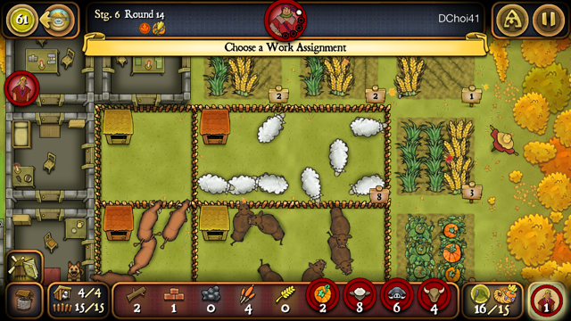

<h1>Agricola</h1>

## Introduction

This assumes a general familiarity with the mechanics of the game (i.e. this isn't a tutorial), but little else.  The purpose of this guide is to help novice players understand the basic shape of the game, so they can make decisions with the right goals in mind.

To understand what I mean by shape, consider the game, Scrabble.

The goal in Scrabble is to score higher than your opponent, but many players play it looking to play the biggest words they can every turn.  This creates a lot of surface area in which their opponent can play, and score big.  With this style of play, players are taking unnecessary risks, and will not win consistently, if at all, against seasoned players.  Instead, players should aim to deny their opponents good plays while claiming bonus tile territory, maintaining a good balance of letters, so they can capitalize on high scoring opportunities when they arise.

Agricola is a game with a lot more moving parts, so understanding the shape of it can be difficult.

## Overview

The goal of the game is to score more points than your opponents.  The cards make it so that it's not a zero sum game, but denying your opponents opportunities to score can do more to secure your victory than blindly going for the highest score you can get yourself.  

In a two player game, for example, consistently taking clay will generally block your opponent from renovating to a clay hut, and will also keep them from renovating from clay to stone.  If they have a 4 room house, that means you've denied them 8 points, which is effectively taking 8 points for yourself, even if you can't use the clay.  Cutting off routes to points is very effective because you can't make up for it by getting absurd amounts of something else.

The way scoring works in Agricola is that you're rewarded for diversity.  Your first grain takes you from -1 point to 1 point, which makes it effectively worth 2 points.  Every grain after the first results in diminishing returns.  This applies to every scoring category besides fields, with which you don't transition from -1 to 1 until your second field.

## The Perfect Farm
You receive a maximum of 4 points per category, with varying upper goals, after which you receive no extra points.  To get 4 points for each category of livestock, you need 8 sheep, 7 boar, and 6 cattle.

To get full points on crops you need 8 grain, and 4 vegetables.

For the farm itself, you need 5 fields, 4 pastures, and 4 fenced stables.

Because of pasture capacity, and limited farm space, the ideal farm has 4 stone rooms, 4 pastures in a 2x3 space, enclosing 2 1x1 spaces and 2 1x2 spaces, with a stable each, and 5 fields.  

	
	

		One ideal layout
	

You begin the game with -14 points (-13 for unused space, +6 for two family members, -7 for fields/pastures/grain/vegetables/sheep/boar/cattle).

With the above structure, you have 8 points for your house, 4 points for pastures, 4 points for fields, and 4 points for fenced stables, for 20 points, and a cost of 34 wood, 4 clay, 4 stone, and 6 reed.  

With 4 points for each type of livestock and crops, you have a total of 40 points.

With 5 family members, you have a baseline scoring potential of 55 points.  If you actually fill your farm out like this, you probably win by default, and it won't generally happen if your opponents are competent at all, but it's good to know what you're shooting for in order to evaluate your results.

## Farm Building
It's easy to figure out where you want to end up, but the game is figuring out how to get there as efficiently as possible.

Because the game rewards you for diversifying, it's tempting to try to take a balanced approach throughout the game, doing some ranching livestock, and some planting crops.  Playing this way will tend to give you an early lead, but point gains will tend to drop off later on, and you'll likely end up with 30-40 points, which isn't bad, but you can do better.  Points only matter at the end of the game, and confer no advantage, so an early lead is meaningless.

The problem with a balanced approach is that it's inefficient.  To convert grain to food efficiently, you need an oven.  To convert animals to food, you need a Fireplace or Cooking Hearth.  Getting both requires several actions gathering resources, and building the improvements.  Furthermore, grain must be planted to be an efficient source of food, which requires plowing and sow/bake actions, and pastures must be built to support livestock breeding, and trying to do both will prevent you from being great with either.  i.e. You won't have enough fields or you won't have enough pastures.

What's generally better is to specialize in one or the other, and fill in the gaps once your primary food engine is established and fulfilling your needs.  For example, getting a Cooking Hearth and getting a set of each kind of animal, with space to breed them, provides you with 9 food per harvest, which means you don't have to spend actions securing food, and can then spend them plowing fields, and taking seed crops.

By specializing, you can develop the infrastructure necessary, and utilize bonuses from improvements and occupations to feed efficiently.  If you keep finding yourself taking grain to bake, or frequently taking animals to eat, you've failed to develop your farm properly.

## Food is Freedom
The surest way to lose a game of Agricola is to neglect your food engine.  When you can't feed your family, every food you miss by costs you 3 points, which, in a game where 50 points is a high score, is enormous.  Likewise, if you always have to scramble to grab a couple of food here and there, which keeps you from taking begging cards, you're not spending those actions getting points.

Any time you're in a position where you're not guaranteed to be able to feed your family, you can be manipulated by other players.

Slippery Slope

Consider a 2 player game, in round 6, with no family growth yet, so each player has 2 actions per round.

You're the starting player, and you decide to take a large stack of reed with your first action.  You have 0 food, need 4 to feed at the end of round 7, and you're hoping to grab the pile of 4 food from the Fishing action with your next move, since I already have as much food as I need, and there's a pile of 6 wood that you know I want to use to build a room and some stables.

Instead of taking the wood, I take the food from fishing, and now you have 3 actions to get 4 food.  There's enough clay to get the second fireplace, but by the time you take the clay, build the fireplace, and then try to take sheep, I could have taken the sheep, or taken the Major Improvement space to upgrade my Fireplace to a Cooking Hearth to block you, so that plan isn't safe.  So now you have to take Day Laborer, and hope you can get it again next round.

With my second action, I take starting player and play a minor improvement.  There's now 9 wood piled up, but instead of taking it, I take Day Laborer.  Now you have 2 actions to get 2 food, and the best you can do is take the 1 food from Fishing, and take a grain and eat it raw.  So you take one of them.

I decide not to block you on your second food, and take 4 clay instead, which I can use to renovate later, and you now have to wait another 3 rounds before you can get enough clay for a fireplace.

You take your second food with the last action, we both feed, but I now have 6 extra food, enough for the next harvest, and I take 12 wood with the first action of round 8, and you're again in a situation where you need 4 food to feed next round, with no possibility of a fireplace to cook sheep, boar, vegetables or bake for 2.  If you opt to deny me 2 reed, you know I can block you on Day Laborer, and it would just be a repeat of last time, so you spend your first action on Day Laborer, I take reed, expand next round, and proceed to steamroll you the rest of the game.

Because you didn't secure your food, you got forced to take 4 actions in a row doing precisely nothing to help you develop your farm.

(If you took the food first, I'd have to choose between the wood and reed piles, but whichever I chose, you'd get the other, and it would be much more even.)

Remember to think before you grow your family.  Every family member needs to be fed two food at harvest, unless they're grown the round of the harvest, in which case they only need to be fed 1.  Sometimes, it doesn't pay off to get an extra action earlier, if it means you'll have to spend extra turns gathering food, or if it will keep you from being able to breed your animals.  You don't want to grow your family just to be put in a situation where you can be starved or manipulated.  Make sure you have enough food before you grow, and a plan to be able to feed at full price next harvest.

## Baking Basics
To sustain a baking engine, you'll generally need two grain fields fairly early, in order to be able to bake, and to have extra grain to sow, to continue your baking cycles.  Without improvements, you're generally looking at sowing 2 fields before the first harvest, or sowing once before the first harvest, and again before the second.  This is a lot of actions to spend at a time when you generally want to be focusing on house expansion and family growth.  Occupations and improvements that provide more grain can really help to soften this blow.  Seasonal Worker, Corn Scoop, Seed Seller, etc.  Plows are actually not that useful for bakers because by the time you can play them, it's generally already too late to get your fields going.

Later in the game, wood is less contested, so try to position for highly efficient wood grabs so you can fence all at once to fill in your farm.

## Ranching Basics
To ranch effectively, you need space for your animals to breed, which means at least a fenced pasture, or two stables, which will both cost you 4 wood.  

An effective way to get your ranch started is to collect 9 wood, 2 reed, and build your first wooden room and two stables, commonly referred to as "breeding stables".  This allows you to hold two animals in your stables and breed one into your home, which you can eat every harvest.  The breeding animals that you hold onto also provide you with extra flexibility to skip normal feeding actions to capitalize on high value resource grabs and the like.  One more benefit to breeding stables is that it gives you the capacity right away to hold 3 types of animals, which is worth 6 points.  So if you keep getting blocked on wood with which to fence, you're at least not blocked on points for animals in the late game.

For 6 more wood, you can fence a separate 1x2 pasture that will allow you to breed a second type of animal.  Or for 7 wood, you can fence your stables.

You may be better off just eating your initial sheep, so you can afford to keep a breeding pair of boar, and use the extra flexibility to try to grab more wood for full fences, as they are the easiest way to cover ground and clear negatives.

In order to breed, you need to have enough food that you can hold onto your grabbed animals, instead of eating them.  Don't hesitate to take piles of food from Fishing or Traveling Players to buy yourself the necessary surplus early on, because breeding animals will make you much more flexible for the rest of the game.

## Baking or Ranching
Generally speaking, baking is not advisable unless you have a hand that strongly supports it.  A Clay Oven converts up to 1 grain to 5 food, which is a good deal, but it requires an action that combines with the sow action, which you usually aren't going to want to do more than once per harvest.  With a large family, that means you will have to supplement your food income.

Add to this, there's only one sow/bake spot on the board, regardless of the number of players.  When the player count is low, there are plenty of animals, so why bake?  When the player count is high, the sow/bake spot is highly contested, because even ranchers need to sow crops, so why bake?  You really need a good reason.

Ranching utilizes a Fireplace or Cooking Hearth and allows you to convert animals and vegetables to food at any time.  They also provide a low efficiency bake option, which can be a lifesaver sometimes.  In the absence of a strong reason to bake, you should default to ranching.

Cues to Bake

Certain occupations and improvements can make baking a solid choice.  There are some cards that will make it seem like you have a strong baking hand, but it can sound better than it really is.  Generally, you'll need a combination of a few.

Because you don't really want to spend 5 actions setting up 2 grain fields before first harvest, and around 3 actions collecting resources and building an oven, look for ways to save on these actions.

The reason you need two fields, normally, is because taking 1 grain is very inefficient, and you want to sow each time you bake.  The Corn Scoop, Market Crier, Market Woman, Seed Seller, Grain Cart will all supply multiple grain per action, which will mitigate the need for early double fields.

Serf provides you with a grain before every sow/bake action, so you can bake effectively with no fields, even, though it's still better to get sows in with the action.  The Baker also lets you get away with fewer fields, because you can bake after harvesting, which gives you tremendous freedom in your worker placement.  Playing the Baker also gives you a free bake action as you're playing the occupation, which you shouldn't waste.  

Field Watchman lets you plow a field every time you take a grain, which makes setting up grain fields totally effortless.  The Acreage minor improvement gives you two fields to plant grain in for free, if you have one occupation.

The Bakehouse, Baker's Kitchen, and Baker's Oven all provide the same utility, but differ by stone cost and victory points.  Stone is hard to get, so cheaper is better.  These let you bake 2 grain into 10 food, which is super efficient, and will leave you with huge surpluses of food if used every harvest, and will buy you breathing room when you can't work it in.  The fact that you can bake as soon as you play them gives you a lot of space to work.

The Millstone adds 2 food to baking actions (this happens once per baking action, not per grain baked), which can make a Clay Oven able to stand on its own, but I'll just as often use it to enhance the baking on my Cooking Hearth, making it the most flexible cooking improvement possible.  Really not bad for 1 stone.

In 2 and 3 player games, it's either impossible to get early stone for an oven, or very inefficient (using the 1 building resource space in 3P).  The Baking Tray lets you reduce the cost of each oven by one resource of your choice, and turns them into minor improvements for you, letting you lump building them in with family growth, or starting player.  I don't believe it's enough to justify baking on its own, but it helps tip the scale that way.

Cards that let you get a bunch of different kinds of animals, I think, are a good incentive to bake.  Animal Handler, Clay Seller, Farmer, to a certain extent, will let you fill out your farm at the end of the game, and reinforce baking strategies.

Cards that add extra opportunities to bake will make baking a little safer, as you'll have alternatives to the sow/bake space.  Bread Paddle, Flail and Threshing Board fall into this category.

There are a bunch of cards that will let you sow extra onto a field, but I think these generally work better for ranchers, and aren't a good incentive to bake.  If you're baking, you're sowing often, and shouldn't have trouble maxing out your crops.

There are more cards, but if I don't see a few of these, I generally won't consider baking.

## Number of Players
Because of the different actions that are available with different numbers of players, there are some considerations to be made for the relative demand for resources and actions.

In general, as the number of players goes up, the availability of building resources goes with it, but access to food sources decreases.  e.g. A five player game gets the same number of spawned sheep, boar and cattle as a 2 player game, but it's much easier to get the wood necessary to support breeding.

**2 players**, there's very little of every resource to go around.  Baking is generally inadvisable, but especially so with 2 players.  Letting your opponent take all the animals for easy food is basically suicide, and you have no access to stone with which to build ovens until rounds 5-7.  Heads up play is very directly confrontational, and deserves its own section.

**3 players**, reed is incredibly sparse, and wood and clay are somewhat easier to manage.  It also includes the wildcard building resource spot, which makes it easier to get an early oven, or play improvements like the Axe, which requires stone pretty early.

**4 players**, resources are fairly plentiful, but there's still only one spot to build rooms, and one spot to grow your family, so jockeying for position on those actions is a big part of 4er play.

**5 players**, there's a crazy amount of clay, and there's a little less stone and reed per capita.  There's also heavy competition over cooking hearths, so prioritize them a little more heavily.  There's an additional build room space, and family growth space, compared to the 4 player board, so it's much easier to do that as convenient.

## Building Your Hand
Even if you are playing with totally random hands, instead of 10-3, or drafting, you have to consider your overall plan, and priorities.

Your hand helps to establish your potential, i.e. How you can score points beyond the basic template, and it will provide a path of least resistance to get there when you learn to read it.

One thing that trips up a lot of players accustomed to other games is that there's a strong temptation to combo.

Resist Overcomboing

<blockquote>If I play Bricklayer, Clay Supports, Ladder, and renovate early, I can build rooms for 1 wood each!</blockquote>

You can, and it sounds amazing, but it cost you 4 wood, 1 clay, about 4 actions between playing the improvements, occupation, and renovation, at least 2 actions to gather the resources, and you might not be able to make your first room until round 8 or later, if the renovation action didn't come until round 7.  You can also get blocked out of playing the improvements, delaying you further.

If you're making a pretty standard 4 rooms, it's about ~7 actions to get to 4 rooms.  Compared to the standard route to 4 rooms: 10 wood, 4 reed, takes about 5 actions to gather, and decreases the total available for your opponents to take.  Factoring grabbing clay mid game and renovating, you're still only about breaking even on actions, except you don't really have the option to build 1 room earlier, which can cost you actions overall.

Looking at it favorably, say you did everything ideally, and you built to five rooms, so you save a bit, it cost you 3 cards in your hand for a fairly minor benefit compared to just playing it straight.

If a combo doesn't provide a very large benefit relative to regular play, it's not going to be worth dealing with all of the moving parts that can get snagged by your opponents doing something you didn't expect.

When planning and evaluating what to play vs. what to keep in your hand, or pass on in drafting or discarding, always do the math to see that you're really saving when compared to straight up play.

Some cards are definitely stronger than others, and some combos are absolutely worth it.  Hedge Keeper + Stablehand lets you get 16 points worth of stables and pastures, and opens the door for the full 15 points on animals, for 5 wood, instead of 23.  Getting your first fenced stable for 1 wood can also let you store a lot of sheep that you can use later, even if you got blocked from getting an early fireplace, without setting you back on your progress to room building and family growth.

Card by card evaluations of all EIK improvements and occupations, which I mostly agree with, can be found here:

[Major and Minor Improvements](http://boardgamegeek.com/thread/458895/card-by-card-a-full-review-of-the-improvements)

[Occupations](http://boardgamegeek.com/thread/436563/card-by-card-a-full-review-of-the-occupations-o)

Card costs, effects, and rulings about interactions can be found here:

[Unofficial Agricola Compendium](http://alavigne.net/Gaming/Agricola/agricola-comp-v9.0.html)

In general, I look for:

1. Something that will save me wood.
	- Wood is important all game, for building your rooms so you can grow your family, many minor improvements, and for farming animals, via fences and stables.  A big fencing action is generally the biggest point gain you can get in a single action, and can upset a game where you're way down, if you can accumulate enough wood.
2. Something that will help with food.
	- **Food is freedom**.  The more ways, or more efficiently I can get it, the safer I am, and the more flexible I can be.
3. Something that will help with scarce resources (which vary depending on player count).
	- You never want to be in a situation where your farm development is put on hold because you keep getting blocked on some resource.  I always look for things that will help me secure reed, clay and stone.
4.	Some improvement that I can play for free, or close to free (e.g. 1 wood, or 1 occupation prereq).
	- Starting Player on round 1 can set the tone for the whole game.  Grabbing the first pair of reed in the game puts pressure on your opponents that can leave good options open while your opponents fight over the next pair.  Likewise, getting the first bunch of clay that leads to the first Fireplace can set you up with a big head start.

After those bases are covered, then I look for compact combos that will give me a strong advantage, but getting these out are less important to me than making sure my bases are covered.

I love cards that give you multiple kinds of things.  Market Woman gives you a vegetable and 2 grain for taking a vegetable.  If you don't have any of these, that's a 4 point action.  If you can sow them, that's 3 points, too.  Grocer, Stockman and Greengrocer are similarly nice for shotgunning points out.

I personally favor discounts (Bricklayer, Stonecutter, Thatcher, Wood Carver etc.), over bonuses (Woodcutter, Clay Mixer, Stone Carrier etc.), because I don't have to take the resource first.  e.g. With the Stonecutter, I can build an Axe or a Clay Oven without having to take 1 stone.  

The bonuses are usually higher yield, but when a lot of resources are just synthesized, it makes it less likely you'll be competing for them, which makes it easier for the other players to meet their needs as well.  For example, if you build a Quarry, you're pretty much never going to take the regular stone actions, so they'll pile up and your opponents will get easy stone renovations or major improvements.  Using these kinds of generative bonuses has to be done with the intention of using them to get a head start.  e.g. Building your rooms and stables first, with the Woodcutter, or rushing out major improvements before your opponents get a chance to gather the stone themselves, with the Quarry.

## Game Flow

The game presents you with a lot of options right from the start, and if you don't know what to pay attention to, it can be a little overwhelming.  These are the general cues and benchmarks I use.

1. Stage 1 (rounds 1-4)
	- I focus on getting the resources for my first wooden room, so I can grow to 3 family members, and to set the foundation for my food engine.
		* If I'm planning to bake, I'll try to get my fields started, but will generally put off getting the oven until later, when I can actually afford to give up grain.
		* If I'm planning to ranch, getting a Fireplace is a fairly high priority.  If the first round action is Take Sheep, the Fireplace is top priority, because getting the first pile of sheep is a huge advantage, and if they come out early, it's even better.  I don't find it's generally worth the trouble to try to get storage to breed sheep in the first harvest.
	- Many occupations give more utility the longer you have them, so I try to get ones that are useful all game out early.
		* Likewise for minor improvements.
2.	Stage 2 (rounds 5-7)
	- I generally won't build my first room until this part of the game, just because rushing to have a room built before the first harvest can be a waste if Family Growth doesn't appear until round 7.  I'll continue to gather resources, so that I can possibly build two rooms, or a room and 2 stables.
	- This is a stressful time for feeding, as food engines are poorly developed, and people are trying to grow their families, so I try to get a surplus, so I can be free to capitalize on whatever opportunities arise.
3.	Stage 3 (Rounds 8-9)
	- I try to really solidify my food engine here, and if I have time, I try to get resources for my fourth room to get another family growth, or if I managed to double expand, I gather resources to renovate to clay.  A double expansion and a renovate + Well action can pretty much seal the deal on the game, but renovation + upgrading your Fireplace to a Cooking Hearth is excellent, too.
4.	Stage 4 (Rounds 10-11)
	- If I haven't gotten my fourth room by now, and can't do it at the start of round 10, I just abandon it, work on my farm, and try to make sure I'm starting player going into Round 12, and try to get a Family Growth Without Room.
	- At this stage of the game, you really want to be focusing on points.  Finishing up your fencing, if you're a rancher, or your fields, if you're baking, and getting ready to fill in your holes in the next stage.
		* Gathering wood to fence, if you're baking.
		* Getting 2 vegetables and your first field plowed, if you're ranching.
			- This sets you up to use Plow/Sow for 5 points.
			- If you have 1 grain and you sow it, it's not worth any points, because you don't get your second grain point until 4 grain.
			- Sowing 1 vegetable is the same as taking 1 vegetable.
	- The next two stages have very high efficiency actions that you want to be able to take advantage of, which is why it's so important to have your food situation sorted out.
5.	Stage 5 (Rounds 12-13)
	- Fight over Plow and Sow, Fencing and FG Without Room.
	- If I have cards that give me bonus points I try to get them out now, so there's less risk of getting blocked in the last round.  You don't want to get stuck with Braggart in your hand when you've been building up to get his 9 bonus points all game, just to have the Occupation spots get blocked by Chief and Mendicant.
	- Try to have extra food so you can spend the last round gaining points instead of scrambling for food grabs.
6.	Stage 6 (Round 14)
	- Plan out how you can get the most points, and evaluate how your opponents can get the most points.  Prioritize your actions, and be wary of anything that requires setup (e.g. grabbing resources, playing an occupation, etc.), as your opponents will be super attentive about getting in your way and preventing your scoring.  Don't waste turns grabbing stone when there are two people who already have the resources to renovate at the start of the round.  Find sure ways to score.

## Player Interaction

Denial

I mentioned before that denial can be a good tactic (denying clay can prevent 2 renovations, and denying food can force a lot of inefficient actions), but it's easy to get hooked on that feeling and overdo it.

With two players, your interaction is very direct, and denial is much stronger.  With more players, any single person that you mess with might suffer, but the other players can run away with the game.

I've seen horror stories of people who've taken 100% of the reed all game (which prevents house expansion, family growth and renovation) losing, because their over-focus on denying that one resource let the other players take big stacks of other resources, and there's only so much you can do with that much reed yourself.

Denying reed feels good because it blocks so many important things, but small families are easy to feed, which leaves a lot of freedom.  Notably, denying reed doesn't really have any effect on ability to feed, which I think makes it pretty weak.

I think denying clay is more effective, on account of it interfering with renovations, but also with cooking improvements (fireplaces, cooking hearths, and ovens).  A player who snatches up a lot of wood and reed early can suffer badly if they don't have enough clay to build a Fireplace.  They might have 4 rooms, but won't be able to risk growing their family, leaving their rooms unfilled, and providing them no value.

Ultimately, I think food denial is the only denial consistently worth pursuing.  Accumulating food gives you extra freedom, while making your opponents waste their turns gathering scraps.

What you'll find is that most of the time, your self-motivated play (basing your decisions directly on what will get you the most points), is also the most effective denial strategy.  That is, when you take that pile of 6+ wood, you've denied *everyone* 6+ wood, while making an efficient play for yourself (6 wood normally takes 2 actions to collect).

Starting Player

Being the starting player is very clearly a good thing, as you have access to the largest resource piles, and the best actions in the late game.  Knowing when to take it is a large part of doing well.

Some situations are very clear cues.  If you're taking the last action in a round, and the other players haven't taken wood, you never want to take the wood with your last action.  Even if you don't have a minor improvement to play, it's better to take starting player and take the 6 wood next round.  Two actions for 6 wood is about normal, but you've also taken starting player, and your opponents must take it back.  If you do have a minor improvement to play, then it's just amazingly good.

Starting player in the first round is generally a pretty strong play, because you have access to the first pair of reed or pair of clay, leaving your opponents to scramble for the next pair of reed or 3 clay, while you have some more freedom.  Because of this, I recommend always trying to draft a minor improvement with no prereq, or one that you can get in the first action in the first round.

Round 11 and round 13 are also particularly important rounds to take starting player.  Round 12 opens up family growth without room or plow and sow, which are both very strong.  Round 14 opens up renovate and build fences, which can be a huge point gain.

More experienced players will often try to fill their hands with weaker minor improvements that have low prerequisites or costs, because of the power of the starting player/minor improvement play.  Minors that stay in your hand provide you no benefit at all.

Having a larger family than your opponents also gives you incredible momentum, because you have spare actions to take starting player back whenever you lose it.

When to Build Major Improvements

When you want to play major improvements on your farm, there's some play in the timing.

Getting the first Fireplace in the game is a big advantage, but you can eke out extra advantages for yourself if you delay actually building it.

Consider a two player game (there's 1 clay spot, which accumulates at 1 per round), you're starting player in round 2, and you take the pair of clay instead of the pair of reed, because sheep appeared in the first round, so you know you can probably score a big pile of sheep, which will afford you a lot of flexibility later in the game.

At this point, barring certain occupations, you've secured the first fireplace for yourself, even though you're not technically holding it yet.  By just holding those two clay in your supply, your opponent has to wait 3 more turns for enough clay to pile up before they can take it and be secure in getting a fireplace.  If they take 2 clay, you can build the first fireplace, and they have to take more clay to get one, and they've wasted an action.

Either they take a very ineffient action, to get the 3 clay fireplace, or they wait for 2 rounds, and try to get a Cooking Hearth.  If you already have your fireplace when they take the 4 clay, you can upgrade your fireplace, and block them again.

You *can* build the fireplace as soon as you get the clay, but doing so means you're not taking something else, which isn't secured.  You have to weigh the opportunity cost.  Sometimes you'll need the early food to make a play like early Lover, but most of the time, you're better off taking other opportunities and only building the improvement when you need to, or when doing so will waste your opponents' actions (while you get something you wanted anyway).

A lot of the time, if I get the first fireplace, I'm just as happy to let my opponent take a big stack of sheep that they're just discarding, to deny me.  I got the fireplace I can use all game, and they effectively took 1 sheep, and left other resources open.  Add to that the fact that I can continue to play cooking hearth keepaway, and you can appreciate why getting the first clay is so strong.

Just be wary in situations where your opponent takes starting player before their last turn.  They can take the resources to build the major they want with their remaining turns, so you have to block them earlier.

Generally speaking, I won't make a cooking hearth a high priority.  The value in a cooking hearth is a little extra efficiency in feeding, when eating boar, cattle, vegetables, and baking.  If you set up a sheep engine early, and have any other supplement from occupations or minors, it basically doesn't make a difference.  It's nice to have, but far from vital.  You should be trying to keep as many boar and cows as you can for points anyway.

The point of efficient feeding is that it allows you to take other actions.  If you overprioritize a cooking hearth, it counteracts the small advantage that it gives you, because you're passing up actions and resources that develop your farm, and it's likely to be a waste of time.

The exception is when you know you're going to be eating a lot of those things, like if you have Swineherd, or early vegetables.  I'll also prioritize it if I can burn food for points, like when using the Grocer, or Pelts.

